# Mermaid Diagrams Demo: Visual Storytelling in Tatva

Welcome to the visual side of Tatva! 🎨 Today we're showcasing the brand new **Mermaid.js integration** that allows you to create beautiful diagrams directly in your markdown files.

## What is Mermaid?

Mermaid is a diagramming and charting tool that uses text-based syntax to create diagrams. It's perfect for documentation, explaining processes, and visualizing complex ideas.

---

## 🔄 Flowchart Example

Let's start with a simple flowchart showing the Tatva blog building process:

```mermaid
flowchart TD
    A[Write Markdown Post] --> B{Contains Mermaid?}
    B -->|Yes| C[Process Mermaid Blocks]
    B -->|No| D[Convert to HTML]
    C --> D
    D --> E[Apply Layout Templates]
    E --> F[Generate Static Files]
    F --> G[Deploy to GitHub Pages]
    G --> H[📝 Live Blog Post!]
    
    style A fill:#e1f5fe
    style H fill:#c8e6c9
    style C fill:#fff3e0
```



---

## 🔁 Sequence Diagram

Here's how a user interacts with the Tatva website:


---

## 🏗️ System Architecture

Let's visualize the Tatva website architecture:


---

## 📊 Git Development Timeline

Here's how Tatva evolved over time:

```mermaid
gitgraph
    commit id: "Initial Setup"
    commit id: "Basic Jekyll Structure"
    
    branch feature-templates
    checkout feature-templates
    commit id: "Add Layouts"
    commit id: "Create Includes"
    
    checkout main
    merge feature-templates
    commit id: "Template Integration"
    
    branch feature-styling
    checkout feature-styling
    commit id: "SCSS Setup"
    commit id: "Dark Mode"
    commit id: "Responsive Design"
    
    checkout main
    merge feature-styling
    commit id: "Styling Complete"
    
    branch feature-mermaid
    checkout feature-mermaid
    commit id: "Add Mermaid.js"
    commit id: "Process Code Blocks"
    commit id: "Style Diagrams"
    
    checkout main
    merge feature-mermaid
    commit id: "Mermaid Integration ✨"
```

---

## 🎯 Usage Guide

To create Mermaid diagrams in your posts, simply use:

````markdown

````

### Supported Diagram Types

- **Flowcharts** - Process flows and decision trees
- **Sequence Diagrams** - System interactions over time
- **Class Diagrams** - Object-oriented design
- **State Diagrams** - State machines and workflows
- **Gantt Charts** - Project timelines
- **Git Graphs** - Repository branching visualization
- **User Journey** - UX flow mapping
- **And many more!**

---

## 🎨 Features

✅ **Automatic Processing** - Just use ````mermaid` code blocks  
✅ **Dark Mode Support** - Adapts to your theme preferences  
✅ **Responsive Design** - Looks great on all screen sizes  
✅ **Custom Styling** - Integrates with Tatva's design system  
✅ **Performance Optimized** - CDN delivery for fast loading  

---

## 🚀 What's Next?

With Mermaid.js now integrated, Tatva can visualize:

- **Technical architecture** in development posts
- **Learning journeys** in educational content  
- **Project workflows** in process documentation
- **System designs** in technical blogs
- **Mind maps** for brainstorming sessions

The possibilities are endless! 🌟

---

*Ready to start creating your own visual stories? Check out the [Mermaid documentation](https://mermaid.js.org/) for more diagram types and syntax examples.*

**Happy diagramming!** 📊✨ 