# 🤖 Building an Intelligent Multi-Agent System: How AI Agents Collaborate to Solve Complex Tasks

*Ever wondered how to create a system where AI agents automatically choose the right tools for any task? Welcome to the future of intelligent automation! 🚀*

---

## 🌟 Introduction: The Dawn of Intelligent Agent Orchestration

In the rapidly evolving landscape of AI, we're witnessing a paradigm shift from single-purpose tools to intelligent, collaborative agent systems. Today, I'm excited to share the technical deep-dive into **agents.ai** - a sophisticated multi-agent system that automatically selects the best agent and tool sequence to handle user queries using semantic similarity and advanced orchestration techniques.

🔗 **[Explore the full implementation on GitHub](https://github.com/rockerritesh/agents.ai)**

## 🎯 What Makes This System Revolutionary?

Traditional AI applications follow a rigid, predetermined flow. But what if your system could think, analyze, and automatically determine the best approach for each unique request? That's exactly what this multi-agent system accomplishes:

- **🧠 Intelligent Agent Selection**: Uses cosine similarity with embeddings to find the most relevant agent
- **🔄 Dynamic Tool Orchestration**: Automatically determines optimal tool sequences
- **💭 Context-Aware Processing**: Maintains conversation history for coherent multi-turn interactions
- **🎨 Specialized Expertise**: Five distinct agents, each mastered in specific domains

## 🏗️ System Architecture: The Technical Foundation

### Core Workflow Visualization

The system follows an elegant flow that mimics human problem-solving approaches:

```mermaid
flowchart TD
    A["🧑‍💻 User Query"] --> B["📊 Query Embedding<br/>OpenAI text-embedding-3-large"]
    B --> C["🎯 Agent Selection<br/>Cosine Similarity > 0.5"]
    C --> D{"🤔 Agent Found?"}
    D -->|No| E["💬 General Chat Response"]
    D -->|Yes| F["🛠️ Tool Sequence Planning"]
    F --> G["⚙️ Tool Execution Loop"]
    G --> H["📝 Context Gathering"]
    H --> I["🔄 Tool Function Call"]
    I --> J["💾 Store Results"]
    J --> K{"🔄 More Tools?"}
    K -->|Yes| H
    K -->|No| L["📋 Results Summary"]
    L --> M["✅ Response to User"]
    
    style A fill:#e1f5fe
    style C fill:#f3e5f5
    style F fill:#e8f5e8
    style I fill:#fff3e0
    style M fill:#e8f5e8
```



### Agent Ecosystem Overview

```mermaid
graph TB
    subgraph "🤖 Agent Ecosystem"
        A1["📊 CSVDataAgent<br/>DataframeLoader<br/>AdvanceCSVQuery"]
        A2["😀 EmojiWriter<br/>EmojiTranslator<br/>EmojiMixer"]
        A3["📝 TextSummarizer<br/>KeypointExtractor<br/>ContentExpander"]
        A4["📄 PDFContentWriter<br/>TextExtractor<br/>ContentReformatter"]
        A5["🌐 TranslatorAgent<br/>MultilingualTranslator<br/>StylePreserver"]
    end
    
    subgraph "🔧 Core System"
        B1["🎯 Agent Selection Engine"]
        B2["🛠️ Tool Orchestrator"]
        B3["💬 Conversation Manager"]
        B4["📊 Embedding Generator"]
    end
    
    subgraph "🔌 Integration Layer"
        C1["🧠 OpenAI GPT-4o"]
        C2["🔤 OpenAI Embeddings"]
        C3["📂 File System"]
        C4["💾 Conversation History"]
    end
    
    B1 --> A1
    B1 --> A2
    B1 --> A3
    B1 --> A4
    B1 --> A5
    
    B2 --> B1
    B3 --> B2
    B4 --> B1
    
    B4 --> C2
    B2 --> C1
    B3 --> C4
    A1 --> C3
    A4 --> C3
    
    style A1 fill:#e3f2fd
    style A2 fill:#fff3e0
    style A3 fill:#e8f5e8
    style A4 fill:#fce4ec
    style A5 fill:#f3e5f5
```



## 🔬 Technical Deep Dive: How It All Works

### 1. 🎯 Semantic Agent Selection

The heart of the system lies in its intelligent agent selection mechanism. Here's how it works:

```python
def find_relevant_agents(query, agents_list, top_n=3):
    """Find the most relevant agents based on semantic similarity"""
    query_embedding = get_embedding(query)
    sim_scores = []
    
    for agent in agents_list:
        similarity = CosineSimilarityCalculator.calculate_similarity(
            embedding1=query_embedding, 
            embedding2=agent.embedding
        )
        sim_scores.append({'agent': agent, 'similarity': similarity})
    
    # Sort by similarity score
    sim_scores.sort(key=lambda x: x['similarity'], reverse=True)
    
    # Threshold filtering: only agents with similarity > 0.5
    if sim_scores[0]['similarity'] < 0.5:
        return []  # Fall back to general chat
    
    return sim_scores[:top_n]
```

**Key Innovation**: The system uses OpenAI's `text-embedding-3-large` model to create vector representations of both user queries and agent descriptions, then applies cosine similarity to find the best match.

### 2. 🛠️ Dynamic Tool Sequence Planning

Once an agent is selected, the system dynamically determines the optimal tool sequence:

```python
def determine_tool_sequence(agent, query):
    """Determine the best sequence of tools for the task"""
    context_summary = "\n\nHistory" + str(history)
    
    message = [
        {
            "role": "system",
            "content": DETERMINE_TOOLS.format(agent, context_summary)
        },
        {
            "role": "user", 
            "content": query
        }
    ]
    
    tools_order = get_reply(message, ToolsSeqFinder)
    return tools_order.tools_name_in_seq
```

### 3. 🔄 Execution Flow Sequence


## 🤖 Meet the Agent Squad: Specialized AI Workers

### 1. 📊 **CSVDataAgent** - The Data Scientist
**Specialty**: CSV data processing and analysis
```yaml
tools:
  - DataframeLoader: Loads CSV/Excel files into pandas DataFrames
  - AdvanceCSVQuery: Performs complex queries and filtering
```
**Example Query**: *"Load earthquake.csv and show me the top 10 earthquakes by magnitude"*

### 2. 😀 **EmojiWriter** - The Creative Communicator  
**Specialty**: Emoji content creation and translation
```yaml
tools:
  - EmojiTranslator: Converts text to relevant emojis
  - EmojiMixer: Creates custom emoji combinations
```
**Example Query**: *"Convert 'I love sunny days at the beach' to emojis"*

### 3. 📝 **TextSummarizer** - The Content Analyst
**Specialty**: Text analysis and content expansion
```yaml
tools:
  - KeypointExtractor: Identifies main ideas from text
  - ContentExpander: Expands bullet points to full paragraphs
```
**Example Query**: *"Extract key points from this article and expand them"*

### 4. 📄 **PDFContentWriter** - The Document Processor
**Specialty**: PDF processing and content reformatting
```yaml
tools:
  - TextExtractor: Extracts text from PDF files
  - ContentReformatter: Reformats content into various types
```
**Example Query**: *"Extract text from resume.pdf and reformat as LinkedIn summary"*

### 5. 🌐 **TranslatorAgent** - The Linguistic Expert
**Specialty**: Multilingual translation with style preservation
```yaml
tools:
  - MultilingualTranslator: Translates between languages
  - StylePreserver: Maintains writing style during translation
```
**Example Query**: *"Translate this to Spanish while keeping the formal tone"*

## ⚡ Technical Implementation Highlights

### Embedding-Based Intelligence
The system leverages OpenAI's advanced embedding model for semantic understanding:

```python
def get_embedding(text: str) -> np.ndarray:
    """Generate embeddings using OpenAI's text-embedding-3-large"""
    response = client.embeddings.create(
        model="text-embedding-3-large",
        input=text
    )
    return np.array(response.data[0].embedding)
```

### Pydantic-Powered Type Safety
Every tool input/output is strictly typed using Pydantic models:

```python
class ToolsSeqFinder(BaseModel):
    """Model for finding the best sequence of tools"""
    tools_name_in_seq: List[str]

class AgentInfo(BaseModel):
    """Model for storing agent information"""
    name: str
    description: str
    id: str
    tools: List[Dict[str, Any]]
    parameters: Optional[Dict[str, Any]] = None
    embedding: Optional[Any] = None
```

### Context-Aware Execution
The system maintains conversation history throughout tool execution:

```python
def gather_tool_inputs(tool_name, tool_function, history, previous_outputs):
    """Gather required inputs for tool execution with context"""
    context_summary = "\n\nPrevious tool outputs: " + str(previous_outputs)
    # Use conversation history and previous outputs to determine inputs
    # ...
```

## 🔧 Technology Stack & Dependencies

The system is built on a modern Python stack:

```toml
[project]
dependencies = [
    "openai>=1.78.1",      # LLM integration
    "pandas>=2.2.3",       # Data manipulation
    "pydantic>=2.11.4",    # Type safety
    "pymupdf>=1.25.5",     # PDF processing
    "numpy>=2.2.5",        # Numerical computations
    "pyyaml>=6.0.2",       # Configuration
]
```

## 🚀 Performance & Scalability Considerations

### Similarity Threshold Optimization
The system uses a **0.5 similarity threshold** to balance precision and recall:
- **Above 0.5**: Agent is selected for specialized handling
- **Below 0.5**: Falls back to general conversation mode

### Conversation Context Management
Smart context preservation without memory overflow:
```python
# Store only relevant context for each tool execution
context_summary = "\n\nHistory" + str(history)
```

### Parallel Processing Potential
The architecture supports future enhancements like:
- 🔄 Concurrent tool execution
- 📊 Batch query processing  
- 🌐 Distributed agent deployment

## 🎨 Configuration-Driven Architecture

The entire agent ecosystem is defined in `agents_behaviour.yaml`:

```yaml
- name: CSVDataAgent
  description: "Specialized agent for loading, processing, and extracting insights from CSV data"
  tools:
    - name: "DataframeLoader"
      version: "1.2.0"
      input_schema: {"file_path": "str"}
      output_schema: "pd.DataFrame"
```

This allows for:
- ✅ Easy agent addition/modification
- ✅ Version control for tools
- ✅ Clear separation of concerns
- ✅ Rapid prototyping

## 🔮 Future Enhancements & Roadmap

### 1. **Advanced Agent Capabilities**
- 🧮 Mathematical computation agents
- 🎨 Image processing specialists  
- 🌐 Web scraping agents
- 📈 Real-time data analysis

### 2. **Enhanced Intelligence**
- 🤖 Multi-agent collaboration
- 🔍 Self-improving algorithms
- 📊 Performance analytics
- 🎯 Adaptive threshold learning

### 3. **Enterprise Features**
- 🔐 Authentication & authorization
- 📊 Usage analytics dashboard
- 🌍 Multi-tenant support
- 📱 API Gateway integration

## 🚀 Getting Started: Run It Yourself!

### Quick Setup
```bash
# Clone the repository
git clone https://github.com/rockerritesh/agents.ai.git
cd agents.ai

# Install dependencies
uv sync

# Configure environment
echo "OPENAI_API_KEY=your_key_here" > .env
echo "BASE_URL_OPENAI=https://api.openai.com/v1" >> .env
echo "MODEL_NAME=gpt-4o" >> .env
echo "EMBEDDING_MODEL_NAME=text-embedding-3-large" >> .env

# Run the system
uv run final_version.py
```

### Example Interactions
```bash
# CSV Analysis
"Load the small-eq.csv file and show me earthquake patterns"

# Emoji Translation  
"Convert 'Happy birthday! 🎉' to pure emojis"

# Content Processing
"Summarize this research paper and expand key findings"
```

## 🎯 Key Takeaways for Developers

### 1. **Semantic Understanding is Key**
Using embeddings for agent selection provides much more nuanced understanding than keyword matching.

### 2. **Context Preservation Matters**
Maintaining conversation history enables sophisticated multi-turn interactions.

### 3. **Type Safety Accelerates Development**
Pydantic models catch errors early and improve code reliability.

### 4. **Configuration-Driven Design Scales**
YAML-based agent definitions make the system incredibly extensible.

## 🌟 Conclusion: The Future is Multi-Agent

This multi-agent system represents a significant step toward truly intelligent automation. By combining semantic understanding, dynamic tool orchestration, and context-aware processing, we've created a system that doesn't just execute commands—it thinks about the best way to solve problems.

The implications extend far beyond this implementation:
- 🏢 **Enterprise Applications**: Automated business process handling
- 🎓 **Education**: Personalized learning assistants  
- 🔬 **Research**: Intelligent data analysis pipelines
- 🏠 **Consumer Apps**: Smart home automation

---

### 🔗 Explore Further

- **🐙 [GitHub Repository](https://github.com/rockerritesh/agents.ai)** - Dive into the code
- **📖 [Documentation](https://rockerritesh.github.io/agents.ai/)** - Detailed implementation guide
- **🌟 [OpenAI API Documentation](https://platform.openai.com/docs)** - Understanding the AI foundation
- **📊 [Pandas Documentation](https://pandas.pydata.org/docs/)** - Data manipulation toolkit

### 💬 Join the Conversation

Have questions or ideas for enhancements? Let's connect and build the future of intelligent automation together!

*What fascinating applications can you imagine for this multi-agent architecture? The possibilities are endless! 🚀*

---

*Built with ❤️ using Python, OpenAI GPT-4o, and a vision for intelligent automation* 
