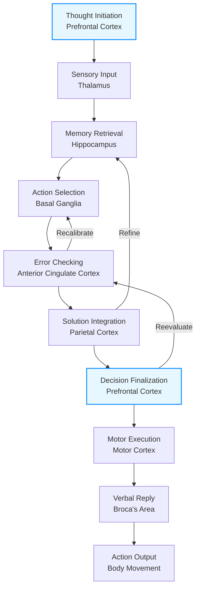
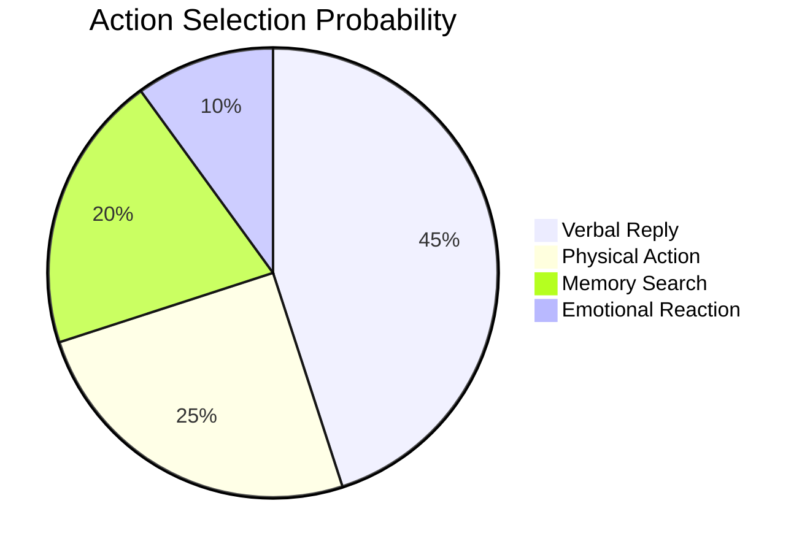

# The Brain's Thinking Cycle: From Thought to Reply  
*Unraveling the Neural Symphony Behind Every Idea and Action*  

## The Cognitive Assembly Line  
When you think and respond, your brain runs an intricate production line with specialized stations:

### 1. **Command Center Activation**  
**Prefrontal Cortex (PFC)** lights up first:  
- Sets mental goals (*"Answer this question"*)  
- Activates working memory buffer  
- Releases dopamine to sustain focus  

### 2. **Information Intake & Routing**  
**Thalamus** acts as central switchboard:  
- Filters sensory input (words on screen/sound)  
- Directs data to relevant processing zones  
- Gates out distractions (background noise)  

### 3. **Memory Mining Operation**  
**Hippocampus** retrieves linked knowledge:  
- Searches episodic memory ("When did I learn this?")  
- Recalls semantic networks ("Related concepts")  
- Tags emotional context via amygdala connection  

### 4. **Decision Factory**  
**Basal Ganglia** selects responses:  

### 5. **Quality Control Checkpoint**  
**Anterior Cingulate Cortex (ACC)** verifies:  
- Detects conflicts ("This contradicts what I know")  
- Triggers error signals (theta wave bursts)  
- Requests reprocessing if needed  

### 6. **Solution Integration Hub**  
**Parietal Cortex** assembles components:  
- Binds concepts into coherent thought  
- Creates mental models ("If I say X, then Y...")  
- Maps spatial relationships (gestures while speaking)  

### 7. **Output Finalization**  
**PFC** approves and packages:  
- Polishes language structure  
- Regulates emotional tone  
- Initiates motor sequence  

### 8. **Reply Execution**  
**Motor Systems** deliver output:  
- Broca's area → word formation  
- Facial nerves → expressions  
- Hand muscles → typing/writing  

## Neurochemical Fuel System  
The cycle runs on precise chemical cocktails:  

| Neurotransmitter | Role                          | Effect on Thinking Cycle          |
|------------------|-------------------------------|-----------------------------------|
| **Glutamate**    | Accelerator                   | Boosts signal transmission speed |
| **GABA**         | Brake                         | Filters irrelevant pathways      |
| **Dopamine**     | Motivator                     | Sustains attention loop          |
| **Acetylcholine**| Memory lubricant              | Enhances recall precision        |

## When the Cycle Breaks: Clinical Snapshots  
**ADHD**: Dopamine deficiency → PFC can't sustain cycle  
*Result*: Thoughts derail at station #1  

**Alzheimer's**: Hippocampal degeneration → Station #3 failure  
*Result*: Knowledge exists but can't be retrieved  

**Stroke Damage**: Parietal lobe lesion → Disrupted integration  
*Result*: Understands concepts but can't articulate  

## Optimizing Your Thinking Engine  
1. **Gamma Wave Boost**: Learn musical instruments (synchronizes frontal-temporal circuits)  
2. **Dopamine Management**: 25-min focused work + 5-min breaks  
3. **Hippocampal Training**: Spaced repetition for memory indexing  

> "The brain operates not as a single thinker but as a committee of experts, each passing partial solutions up the chain until consensus emerges." - Dr. Patricia Churchland

*Final Thought*: This 300ms-to-2-second cycle runs continuously, processing 11 million bits/sec beneath consciousness. What you perceive as "one thought" is actually a symphony of neural committees reaching consensus!

```mermaid
mindmap
  root((Neurons))
    Artificial Neurons
      History
        McCulloch-Pitts Model (1943)
          ::icon(fa fa-history)
        Perceptron (1958)
          Frank Rosenblatt
        Backpropagation (1986)
          Rumelhart & Hinton
        Deep Learning Revolution
          2006 onwards
          Geoffrey Hinton
          Yann LeCun
          Yoshua Bengio
      Structure
        Input Layer
          Weighted connections
          Multiple inputs
          Bias terms
        Processing Unit
          Summation function
          Activation function
            Sigmoid
            ReLU
            Tanh
            Softmax
            Leaky ReLU
        Output
          Single output value
          Passes to next layer
      Mathematical Model
        Linear Combination
          Weighted sum formula
          Plus bias term
        Activation Functions
          Sigmoid function
          Exponential form
          Non-linearity
        Weight Updates
          Gradient descent
          Backpropagation
          Learning rate
      Types
        Perceptron
          Single layer
          Linear classification
        Multi-layer Perceptron
          Hidden layers
          Non-linear problems
        Convolutional Neurons
          Feature detection
          Spatial processing
        Recurrent Neurons
          Memory capability
          Sequential data
        LSTM/GRU
          Long-term dependencies
          Gating mechanisms
      Applications
        Computer Vision
          Image recognition
          Object detection
          Facial recognition
          Medical imaging
        Natural Language Processing
          Machine translation
          Sentiment analysis
          Text generation
          Chatbots
        Autonomous Systems
          Self-driving cars
          Robotics
          Navigation
        Game Playing
          Chess engines
          Go (AlphaGo)
          Video games
        Healthcare
          Drug discovery
          Diagnosis
          Treatment planning
        Finance
          Trading algorithms
          Risk assessment
          Fraud detection
      Advantages
        Parallel Processing
          Massive parallelization
          GPU acceleration
        Scalability
          Handle big data
          Distributed computing
        Consistency
          Deterministic behavior
          Reproducible results
        Speed
          Fast computation
          Real-time processing
        Precision
          Exact calculations
          High accuracy
      Limitations
        Energy Consumption
          High power requirements
          Cooling needs
        Training Requirements
          Large datasets needed
          Computational resources
        Interpretability
          Black box problem
          Difficult to explain
        Overfitting
          Memorization vs learning
          Generalization issues
        Hardware Dependence
          Specialized chips
          Cost barriers
    
    Natural Neurons
      Evolution
        Cambrian Explosion
          540 million years ago
          ::icon(fa fa-leaf)
        Nervous System Development
          Cnidarians (jellyfish)
          Bilateral symmetry
          Centralization
        Brain Evolution
          Fish brains
          Mammalian cortex
          Human neocortex
      Anatomy
        Cell Body (Soma)
          Nucleus
            DNA storage
            Gene expression
          Mitochondria
            Energy production
            ATP synthesis
          Endoplasmic Reticulum
            Protein synthesis
          Golgi Apparatus
            Protein processing
        Dendrites
          Branched extensions
          Synaptic receptors
          Signal reception
          Dendritic spines
          Plasticity
        Axon
          Signal transmission
          Myelin sheath
            Insulation
            Faster conduction
          Axon terminals
          Synaptic vesicles
        Synapse
          Synaptic cleft
          Neurotransmitters
            Dopamine
            Serotonin
            Acetylcholine
            GABA
            Glutamate
          Receptors
          Synaptic plasticity
      Physiology
        Resting Potential
          Negative 70 millivolts
          Sodium potassium pump
          Ion gradients
        Action Potential
          Depolarization
          Threshold negative 55mV
          All or nothing principle
          Propagation
          Refractory period
        Synaptic Transmission
          Chemical signaling
          Neurotransmitter release
          Receptor binding
          Signal integration
        Plasticity
          Hebbian learning rule
          LTP and LTD mechanisms
          Structural changes
          Functional changes
      Types
        Sensory Neurons
          Photoreceptors
          Mechanoreceptors
          Chemoreceptors
          Thermoreceptors
          Nociceptors
        Motor Neurons
          Upper motor neurons
          Lower motor neurons
          Muscle control
        Interneurons
          Local circuits
          Information processing
          Integration
        Pyramidal Neurons
          Cortical processing
          Long-range connections
        Purkinje Cells
          Cerebellum
          Motor learning
        Dopaminergic Neurons
          Reward processing
          Motivation
      Functions
        Information Processing
          Pattern recognition
          Feature detection
          Integration
        Memory Formation
          Encoding
          Storage
          Retrieval
          Consolidation
        Motor Control
          Movement planning
          Execution
          Coordination
        Sensory Processing
          Perception
          Filtering
          Enhancement
        Consciousness
          Awareness
          Attention
          Self-recognition
        Emotions
          Limbic system
          Amygdala
          Emotional memory
      Networks
        Local Circuits
          Cortical columns
          Microcircuits
          Lateral inhibition
        Long-range Connections
          Corpus callosum
          Thalamic connections
          Brainstem pathways
        Brain Regions
          Cerebral cortex
          Hippocampus
          Cerebellum
          Brainstem
          Limbic system
        Oscillations
          Gamma waves
          Theta rhythm
          Alpha waves
          Sleep spindles
      Advantages
        Energy Efficiency
          20 watts total
          Efficient computation
        Adaptability
          Continuous learning
          Plasticity
        Robustness
          Fault tolerance
          Graceful degradation
        Parallel Processing
          Massive parallelism
          Distributed processing
        Context Awareness
          Embodied cognition
          Environmental adaptation
        Creativity
          Novel combinations
          Insight generation
      Limitations
        Processing Speed
          Slow compared to computers
          Millisecond timescales
        Precision
          Noisy signals
          Approximate computation
        Memory Capacity
          Limited working memory
          Forgetting
        Training Time
          Years of development
          Slow learning
        Vulnerability
          Damage sensitivity
          Aging effects
          Disease susceptibility
    
    Comparison
      Similarities
        Information Processing
          Input-output systems
          Signal integration
          Pattern recognition
        Network Architecture
          Interconnected units
          Layered organization
          Hierarchical processing
        Learning Capability
          Adaptation
          Experience-based changes
          Memory formation
        Non-linearity
          Activation functions
          Threshold behavior
          Complex dynamics
      Key Differences
        Speed vs Efficiency
          Artificial: Fast processing
          Natural: Energy efficient
        Precision vs Robustness
          Artificial: Exact computation
          Natural: Approximate but robust
        Learning Style
          Artificial batch learning
          Natural continuous adaptation
        Architecture
          Artificial: Designed structure
          Natural: Evolved complexity
        Processing
          Artificial: Digital/discrete
          Natural: Analog/continuous
        Memory
          Artificial: Perfect recall
          Natural: Reconstructive memory
        Creativity
          Artificial: Pattern matching
          Natural: True innovation
      Hybrid Approaches
        Neuromorphic Computing
          Brain-inspired hardware
          Spiking neural networks
          Event-driven processing
        Memristors
          Synaptic behavior
          Analog memory
          Low power consumption
        Quantum Neural Networks
          Quantum superposition
          Entanglement
          Parallel processing
        Biological-Artificial Interface
          Brain-computer interfaces
          Neural implants
          Cyborg systems
      Future Directions
        Convergence
          Bio-inspired AI
          Artificial consciousness
          Hybrid intelligence
        Applications
          Personalized medicine
          Augmented cognition
          Sustainable computing
        Challenges
          Ethical considerations
          Safety concerns
          Societal impact
        Research Areas
          Computational neuroscience
          Cognitive architectures
          Embodied AI
          Neuroplasticity models
```

