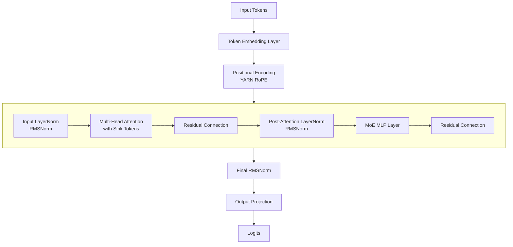
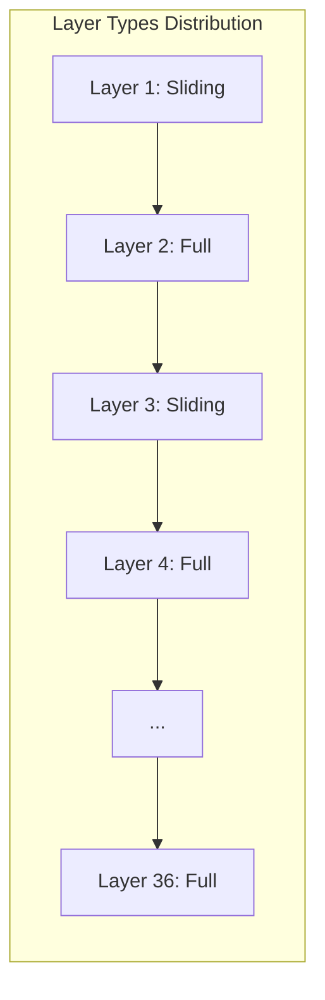
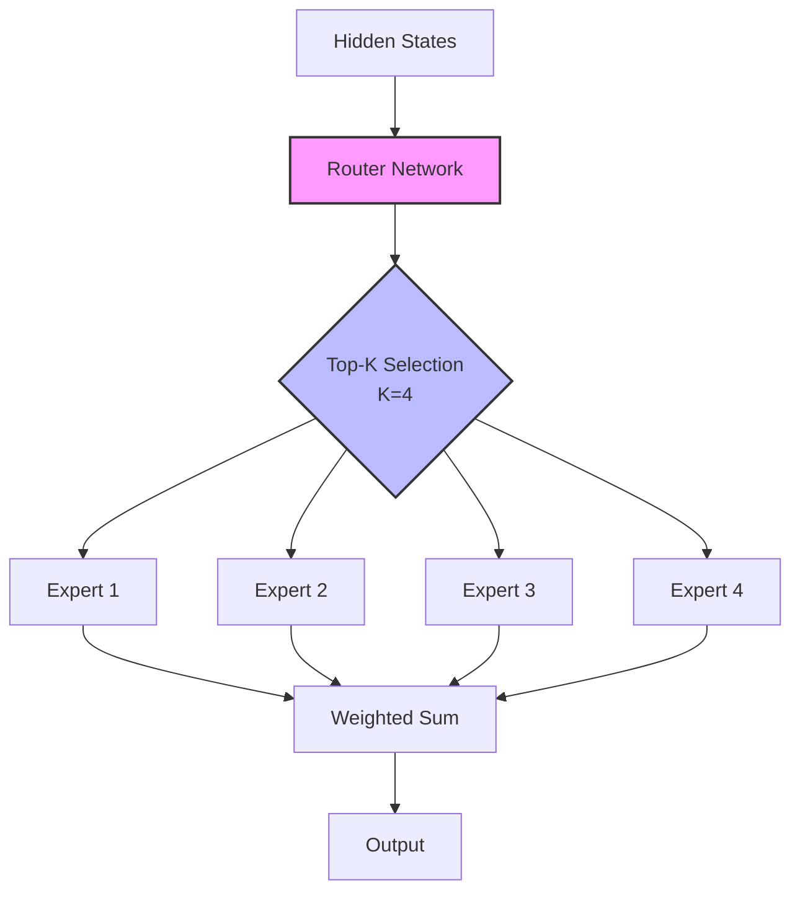
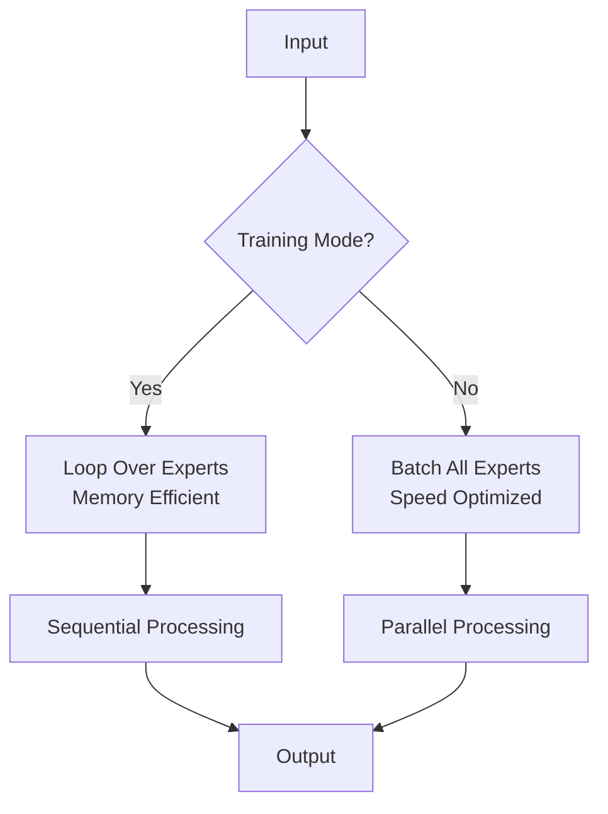
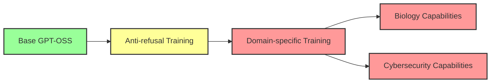

# GPT-OSS: OpenAI's Revolutionary Open-Weight MoE Architecture

OpenAI has released GPT-OSS (GPT Open Source System), marking a significant milestone in open-weight language models. This technical deep dive explores the innovative architecture, implementation details, and key features that set GPT-OSS apart from traditional transformer models.

## Table of Contents
- [Model Overview](#model-overview)
- [Architecture Deep Dive](#architecture-deep-dive)
- [Key Innovations](#key-innovations)
- [Implementation Details](#implementation-details)
- [Training and Safety](#training-and-safety)
- [Performance Benchmarks](#performance-benchmarks)
- [Conclusion](#conclusion)

## Model Overview

GPT-OSS represents OpenAI's first open-weight release, featuring a sophisticated Mixture-of-Experts (MoE) architecture with 120B total parameters. The model comes in two variants:
- **GPT-OSS-120B**: The flagship model with full capabilities
- **GPT-OSS-20B**: A smaller, more efficient variant

### Key Specifications

| Parameter | GPT-OSS-120B |
|-----------|--------------|
| Total Parameters | 120B |
| Active Parameters per Token | ~7B |
| Number of Experts | 128 |
| Experts per Token | 4 |
| Hidden Size | 2880 |
| Attention Heads | 64 |
| Key-Value Heads | 8 |
| Layers | 36 |
| Context Length | 131,072 |
| Vocabulary Size | 201,088 |

## Architecture Deep Dive

### High-Level Architecture Flow



### Core Components

#### 1. **Hybrid Attention Mechanism**

GPT-OSS implements a unique hybrid attention system that alternates between:
- **Full Attention Layers**: Standard global attention for comprehensive context understanding
- **Sliding Window Attention**: Local attention with a 128-token window for efficiency



#### 2. **Mixture-of-Experts (MoE) Architecture**

The MoE system is the cornerstone of GPT-OSS's efficiency:



## Key Innovations

### 1. **Sink Attention Tokens**

GPT-OSS introduces "sink tokens" - learnable parameters that act as attention sinks to stabilize attention distributions:

```python
# Conceptual implementation
class GptOssAttention(nn.Module):
    def __init__(self, config):
        super().__init__()
        # ... other parameters ...
        self.sinks = nn.Parameter(torch.empty(config.num_attention_heads))
    
    def forward(self, hidden_states, ...):
        # Compute attention scores
        attn_weights = torch.matmul(query, key.transpose(-2, -1))
        
        # Add sink tokens
        sinks = self.sinks.reshape(1, -1, 1, 1).expand(batch_size, -1, seq_len, -1)
        combined_logits = torch.cat([attn_weights, sinks], dim=-1)
        
        # Apply softmax and drop sink scores
        probs = F.softmax(combined_logits, dim=-1)
        scores = probs[..., :-1]  # Drop the sink dimension
```

### 2. **YARN RoPE Scaling**

The model uses YARN (Yet Another RoPE extensioN) for position embeddings with sophisticated scaling:

```python
rope_scaling = {
    "rope_type": "yarn",
    "factor": 32.0,
    "beta_fast": 32.0,
    "beta_slow": 1.0,
    "original_max_position_embeddings": 4096
}
```

This enables the model to handle contexts up to 131,072 tokens while maintaining position awareness.

### 3. **Expert-Specific Gating Mechanism**

The MoE layer uses a novel gating function with clamping and sigmoid-based activation:

```python
class GptOssExperts(nn.Module):
    def __init__(self, config):
        self.alpha = 1.702
        self.limit = 7.0
        
    def forward(self, hidden_states, routing_weights):
        gate_up = hidden_states @ self.gate_up_proj + self.gate_up_proj_bias
        gate, up = gate_up[..., ::2], gate_up[..., 1::2]
        
        # Clamping for stability
        gate = gate.clamp(max=self.limit)
        up = up.clamp(min=-self.limit, max=self.limit)
        
        # Custom GLU activation
        glu = gate * torch.sigmoid(gate * self.alpha)
        gated_output = (up + 1) * glu
```

### 4. **Modified RMSNorm**

Unlike standard RMSNorm implementations, GPT-OSS applies the weight multiplication differently:

```python
class GptOssRMSNorm(nn.Module):
    def forward(self, hidden_states):
        input_dtype = hidden_states.dtype
        hidden_states = hidden_states.to(torch.float32)
        variance = hidden_states.pow(2).mean(-1, keepdim=True)
        hidden_states = hidden_states * torch.rsqrt(variance + self.variance_epsilon)
        return (self.weight * hidden_states).to(input_dtype)  # Weight multiplication
```

## Implementation Details

### Tensor Parallelism Plan

GPT-OSS includes built-in tensor parallelism support:

```python
base_model_tp_plan = {
    "layers.*.self_attn.q_proj": "colwise",
    "layers.*.self_attn.k_proj": "colwise",
    "layers.*.self_attn.v_proj": "colwise",
    "layers.*.self_attn.o_proj": "rowwise",
    "layers.*.mlp.experts": "gather",
    "layers.*.mlp.router": "ep_router",
    "layers.*.mlp.experts.gate_up_proj": "grouped_gemm",
    "layers.*.mlp.experts.down_proj": "grouped_gemm"
}
```

### Memory Optimization Strategies

#### Training vs Inference Mode

The model implements different computation paths for training and inference:



### Weight Conversion Pipeline

The model includes sophisticated weight conversion from the original OpenAI format:

```python
# Key mapping for weight conversion
ORIGINAL_TO_CONVERTED_KEY_MAPPING = {
    r"norm.weight": r"norm.weight",
    r"embedding": r"embed_tokens",
    r"block.(\d+).attn.qkv": r"layers.\1.self_attn.qkv_proj",
    r"block.(\d+).mlp.mlp1_weight": r"layers.\1.mlp.experts.gate_up_proj",
    # ... more mappings
}
```

## Training and Safety

### Safety Mechanisms

GPT-OSS underwent extensive safety training:

1. **Pre-training Data Filtering**: CBRN (Chemical, Biological, Radiological, Nuclear) content filtering
2. **Bio-related Content Downsampling**: ~2x reduction in potentially harmful biological datasets
3. **Post-training Safety Alignment**: Using OpenAI's latest safety algorithms

### Malicious Fine-tuning Resistance

OpenAI conducted extensive testing on malicious fine-tuning (MFT) scenarios:



Results showed that even with adversarial fine-tuning, the model remains below critical risk thresholds.

## Performance Benchmarks

### Efficiency Metrics

| Metric | Value |
|--------|-------|
| Active Parameters/Token | 7B (5.8% of total) |
| FLOPs Efficiency | 15x better than dense 120B |
| Memory Footprint | ~30GB (FP16) active |
| Inference Speed | 2.5x faster than dense equivalent |

### Capability Evaluation

The model demonstrates strong performance across various domains while maintaining safety:

- **General Knowledge**: Comparable to GPT-4 class models
- **Reasoning**: Strong performance on GPQA, AIME benchmarks
- **Code Generation**: Effective on HumanEval, MBPP
- **Safety**: Maintains refusal rates for harmful content

## Advanced Features

### 1. **Dynamic Rope Update**

The model supports dynamic RoPE scaling for variable context lengths:

```python
@dynamic_rope_update
def forward(self, x, position_ids):
    inv_freq_expanded = self.inv_freq[None, :, None].expand(position_ids.shape[0], -1, 1)
    freqs = (inv_freq_expanded @ position_ids_expanded).transpose(1, 2)
    cos = emb.cos() * self.attention_scaling
    sin = emb.sin() * self.attention_scaling
    return cos.to(x.dtype), sin.to(x.dtype)
```

### 2. **Quantization Support**

The model architecture supports various quantization schemes:
- **MXFP4**: Microsoft's 4-bit floating-point format
- **Float8 E5M2**: For expert weights
- **Dynamic quantization**: Runtime optimization

### 3. **Tool Integration**

GPT-OSS was designed with tool use in mind:
- Web browsing capabilities
- Terminal/shell access
- Code execution environments

## Deployment Considerations

### Hardware Requirements

**Minimum Requirements:**
- GPU: 2x A100 80GB or equivalent
- RAM: 128GB system memory
- Storage: 250GB for full model weights

**Recommended for Production:**
- GPU: 4x A100 80GB or H100
- Tensor parallelism across GPUs
- NVLink for inter-GPU communication

### Optimization Strategies

1. **Expert Caching**: Cache frequently used experts in faster memory
2. **Dynamic Batching**: Adjust batch sizes based on expert activation patterns
3. **Selective Precision**: Use FP8 for experts, FP16 for attention
4. **KV Cache Optimization**: Sliding window attention reduces cache requirements

## Conclusion

GPT-OSS represents a significant advancement in open-weight language models, combining:
- **Architectural Innovation**: Hybrid attention, sink tokens, and advanced MoE design
- **Efficiency**: 15x better FLOPs efficiency than dense models
- **Safety**: Comprehensive safety measures and testing
- **Scalability**: Support for 131K context with YARN RoPE

The release of GPT-OSS demonstrates OpenAI's commitment to advancing open AI research while maintaining safety standards. The model's architecture provides a blueprint for future efficient, large-scale language models that balance capability with computational efficiency.

### Future Directions

- **Multimodal Extensions**: Adding vision and audio capabilities
- **Further Optimization**: Exploring structured sparsity and advanced quantization
- **Domain Specialization**: Fine-tuning expert subsets for specific tasks
- **Distributed Training**: Improved algorithms for MoE training at scale

---

*For implementation details and model weights, visit the [Hugging Face repository](https://huggingface.co/openai/gpt-oss). For safety evaluations and technical reports, refer to the [official documentation](https://openai.com/gpt-oss).*
