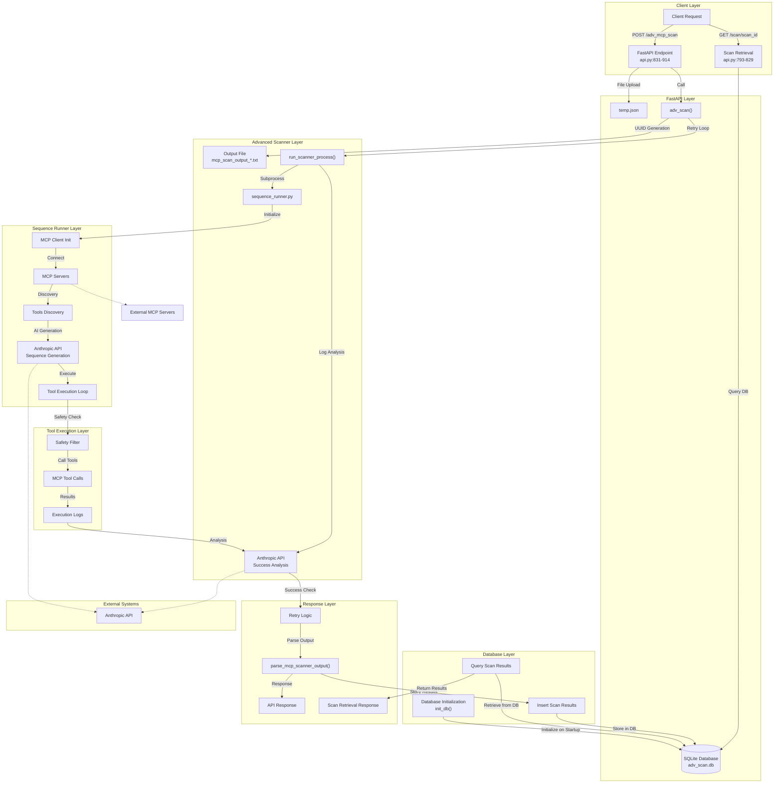

The `Advance MCP Scanner` orchestrates a complex multi-component system that:
- Uploads and processes MCP configuration files
- Discovers and executes MCP tools dynamically
- Uses AI for sequence generation and success analysis
- Provides comprehensive logging and retry mechanisms
- **Stores scan results and metadata in SQLite database for persistence and retrieval**

## Complete Data Flow

