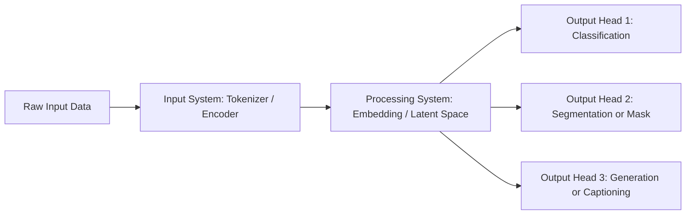

## Neural Modularity Principle: Decoupling Input, Processing & Output: A Better Architectural Principle for Models

### Introduction

In much of the current model-design practice, we see input, processing and output all bundled together into one monolithic block. But this conflation hides a core architectural opportunity. I propose that **Input**, **Processing**, and **Output** should each be **distinct systems**. When done right, this separation unlocks flexibility, reuse, and simpler fine-tuning.

---

### The problem with “everything in one block”

* Many models accept arbitrary input, process it, and produce output in one go. That means: input *tokenizer/encoder + embedding/latent space + output head/classifier/regressor* are tightly coupled.
* This coupling has several drawbacks:

  * **Lack of determinism in input** – when input is heterogeneous, the model’s behaviour becomes less predictable.
  * **Processing and output are tied** – changing the output (say from classification to segmentation) often requires re-training large parts of the system.
  * **Poor reuse** – you cannot easily swap out an output head, or reuse the same processing for different tasks, because everything is interwoven.

---

### A better way: three distinct systems

To address this, I argue for a model architecture with **three separate systems**:

1. **Input system** – deterministic preprocessing and tokenization/encoding of raw data into a well-defined intermediate form.
2. **Processing (embedding) system** – this system consumes the intermediate form, produces a unified latent/embedding representation (the “hippocampus” of the architecture).
3. **Output system(s)** – one or more heads that consume the latent representation and produce task-specific output (segmentation, classification, mask, generation, etc).

In effect:

```
Input system → Processing/Embedding system → Output system
```

Each system is modular and can be improved or replaced independently.

---

### Why this modular decomposition matters

* **Switching output heads becomes trivial**: once you have an embedding system, you can attach a classification head, a segmentation head, or a mask-head, all without retraining the embedding system from scratch.
* **Better reuse**: the embedding system becomes a universal “brain”, the hippocampus of your architecture, and you just plug in different outputs depending on the task.
* **Deterministic input** means that you always know exactly what the embedding system will receive, making debugging, evaluation and robustness easier.
* **Separation of concerns**: teams can work on input modules, embedding modules, and output heads independently — analogous to software engineering best practice.
* **Reduced fine-tuning cost**: you don’t have to fine-tune a gigantic model for every task — you only fine-tune or train the output head, assuming the embedding system is robust.

---

### Real-world examples

Let’s look at two recent models that illustrate parts of this vision:

#### Example 1: SAM

Segment Anything Model (SAM) by Meta AI is a promptable segmentation system trained on 11 M images and 1.1 B masks. ([arXiv][1])
While SAM is primarily a segmentation system, we can view it as:

* Input: image + prompt (point/box)
* Processing: the encoder/latent embedding of the image and prompt
* Output: mask prediction

It shows how a **universal encoder + prompt input** can generate rich outputs for segmentation tasks. But SAM still bundles a specific output head (mask generation) rather than offering a more generic output head paradigm.

#### Example 2: DeepSeek-OCR

DeepSeek‑OCR (by DeepSeek AI) decouples vision encoding and decoding in a way that more closely aligns with our proposal. The architecture:

* Visual encoder (“DeepEncoder”) transforms high-resolution image data into a compressed visual token representation. ([Medium][2])
* Decoder (DeepSeek3B-MoE) performs OCR/understanding from those compressed tokens. This separation roughly maps to input vs processing vs output. ([arXiv][3])
  By clearly separating vision encoding (input → processing) and the decoder head (processing → output), DeepSeek-OCR embodies the modular principle.

---

### Proposed architecture (mermaid diagram)



You may embed this diagram in your blog to illustrate the separation of systems.

---

### Implementation tips for developers

* **Define a deterministic input interface**: e.g., fixed tokenization, padding/truncation rules, consistent preprocessing.
* **Train or adopt a robust embedding/latent module**: this becomes your “universal brain”. Once trained, freeze or semi-freeze it for different tasks.
* **Design modular output heads**: classification head, segmentation head, regression head, etc., each taking the same latent representation.
* **Switching tasks = swapping heads**: instead of retraining large model cores, you just fine-tune the output head while keeping the embedding system fixed.
* **Monitor the embedding space**: ensure the latent representation generalizes well across tasks, and doesn’t overfit one head.
* **Versioning modules separately**: track versions of input system, embedding system, and output heads independently.

---

### Why this architecture can “solve” multiple applications

* Because the embedding module is decoupled, you can apply the same “brain” to image, text, or multimodal tasks — you just change the input encoder and output head.
* The architectural re-use reduces the need for full model retraining per task.
* This approach aligns with how the brain’s hippocampus acts as a central memory/embedding structure, while separate sensory organs (input) and motor/output systems interface with it.
* Practically: you could build a system where you add a segmentation head today, a classification head tomorrow, and a captioning head next week, all using the same embedding system.

---

### Conclusion

By explicitly separating **Input**, **Processing/Embedding**, and **Output** into distinct systems, we gain modularity, flexibility, reuse and lower fine-tuning cost. The examples of SAM and DeepSeek-OCR show that parts of this architecture are already emerging. As developers and researchers (like you!), we can push **modular model architecture** forward — build the embedding hippocampus once, and plug in many heads.
