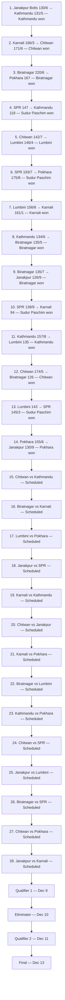

# Nepal Premier League — Fixtures & Results (Mermaid flowchart)

Below is a compact, readable flowchart that lays out each match in chronological order with score & result.

```mermaid
flowchart TD

M1["1. Janakpur Bolts 130/6 → Kathmandu 131/5 — Kathmandu won"]
M2["2. Karnali 166/3 → Chitwan 171/6 — Chitwan won"]
M3["3. Biratnagar 220/6 → Pokhara 167 — Biratnagar won"]
M4["4. SPR 147 → Kathmandu 118 — Sudur Paschim won"]
M5["5. Chitwan 142/7 → Lumbini 146/4 — Lumbini won"]
M6["6. SPR 193/7 → Pokhara 175/8 — Sudur Paschim won"]
M7["7. Lumbini 156/8 → Karnali 161/1 — Karnali won"]
M8["8. Kathmandu 134/6 → Biratnagar 135/5 — Biratnagar won"]
M9["9. Biratnagar 135/7 → Janakpur 126/9 — Biratnagar won"]
M10["10. SPR 139/9 → Karnali 94 — Sudur Paschim won"]
M11["11. Kathmandu 157/8 → Lumbini 135 — Kathmandu won"]
M12["12. Chitwan 174/5 → Biratnagar 126 — Chitwan won"]
M13["13. Lumbini 143 → SPR 145/3 — Sudur Paschim won"]
M14["14. Pokhara 155/6 → Janakpur 130/9 — Pokhara won"]

%% Upcoming matches
M15["15. Chitwan vs Kathmandu — Scheduled"]
M16["16. Biratnagar vs Karnali — Scheduled"]
M17["17. Lumbini vs Pokhara — Scheduled"]
M18["18. Janakpur vs SPR — Scheduled"]
M19["19. Karnali vs Kathmandu — Scheduled"]
M20["20. Chitwan vs Janakpur — Scheduled"]
M21["21. Karnali vs Pokhara — Scheduled"]
M22["22. Biratnagar vs Lumbini — Scheduled"]
M23["23. Kathmandu vs Pokhara — Scheduled"]
M24["24. Chitwan vs SPR — Scheduled"]
M25["25. Janakpur vs Lumbini — Scheduled"]
M26["26. Biratnagar vs SPR — Scheduled"]
M27["27. Chitwan vs Pokhara — Scheduled"]
M28["28. Janakpur vs Karnali — Scheduled"]

%% Playoffs
Q1["Qualifier 1 — Dec 9"]
ELIM["Eliminator — Dec 10"]
Q2["Qualifier 2 — Dec 11"]
FINAL["Final — Dec 13"]

%% Flow order
M1 --> M2 --> M3 --> M4 --> M5 --> M6 --> M7 --> M8 --> M9 --> M10 --> M11 --> M12 --> M13 --> M14 --> M15 --> M16 --> M17 --> M18 --> M19 --> M20 --> M21 --> M22 --> M23 --> M24 --> M25 --> M26 --> M27 --> M28 --> Q1 --> ELIM --> Q2 --> FINAL
```

---
