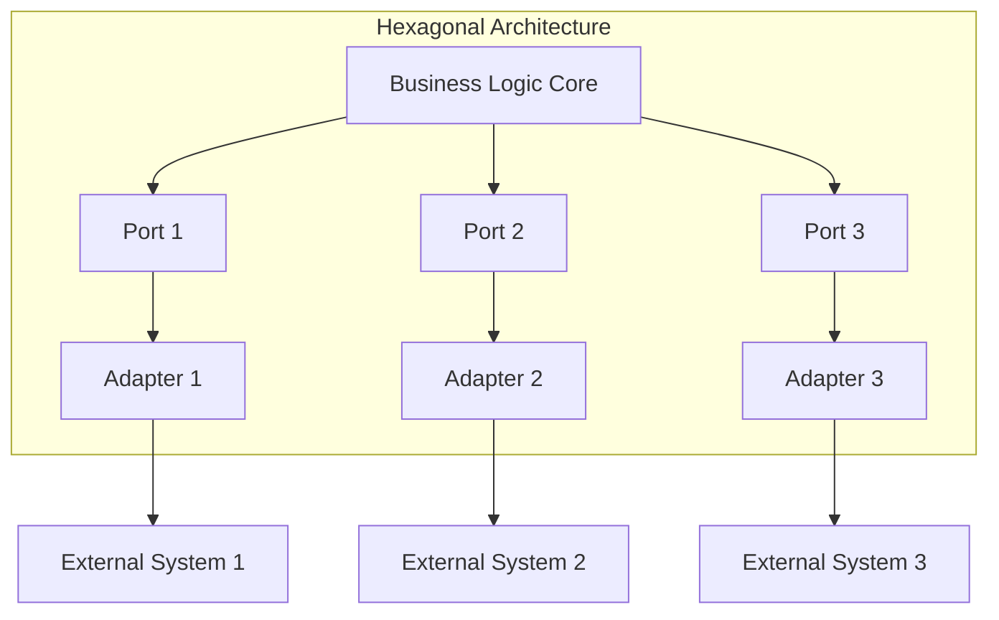
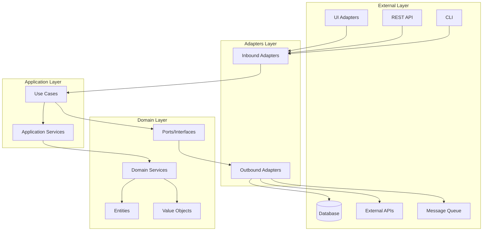
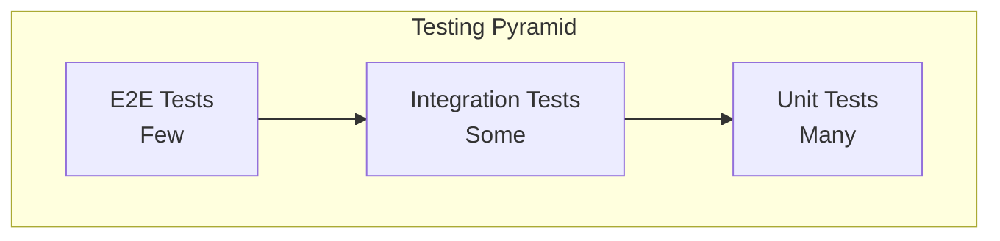

# Mastering Hexagonal Architecture: A Complete Guide with Python Implementation

> **"The business logic should not depend on the frameworks; instead, the frameworks should depend on the business logic."** - Alistair Cockburn

## Table of Contents

1. [Introduction](#introduction)
2. [What is Hexagonal Architecture?](#what-is-hexagonal-architecture)
3. [Core Concepts](#core-concepts)
4. [Architecture Layers](#architecture-layers)
5. [Benefits and Trade-offs](#benefits-and-trade-offs)
6. [Implementation Patterns](#implementation-patterns)
7. [Python Implementation](#python-implementation)
8. [Testing Strategy](#testing-strategy)
9. [Best Practices](#best-practices)
10. [Common Pitfalls](#common-pitfalls)
11. [Conclusion](#conclusion)

---
https://github.com/rockerritesh/example-hexagonal-service.git
## Introduction

In modern software development, maintaining clean, testable, and maintainable code is paramount. As applications grow in complexity, the traditional layered architecture often leads to tight coupling, making systems difficult to test, modify, and scale. **Hexagonal Architecture**, also known as **Ports and Adapters**, provides a solution to these challenges by inverting the dependency flow and isolating business logic from external concerns.

This article provides a comprehensive exploration of Hexagonal Architecture, from theoretical foundations to practical Python implementation, complete with working examples and test strategies.

---

## What is Hexagonal Architecture?

Hexagonal Architecture, coined by Alistair Cockburn in 2005, is an architectural pattern that aims to create loosely coupled application components that can be easily connected to their software environment through ports and adapters. The "hexagon" is a visual metaphor—the shape doesn't matter, but the idea of having multiple entry and exit points does.

### The Core Philosophy



The architecture is built on three fundamental principles:

1. **Isolation**: Business logic is isolated from external frameworks, databases, and UI
2. **Independence**: The application can be developed and tested independently
3. **Flexibility**: External dependencies can be swapped without changing core logic

---

## Core Concepts

### 1. Ports (Interfaces)

**Ports** are interfaces that define how the application communicates with the outside world. They represent contracts that the application expects to be fulfilled.

#### Types of Ports:

- **Inbound Ports (Driving Ports)**: Define how external actors interact with the application
  - Example: `UserService` interface that defines user operations
  - Example: REST API endpoints, CLI commands, message queue handlers

- **Outbound Ports (Driven Ports)**: Define how the application interacts with external systems
  - Example: `UserRepository` interface for data persistence
  - Example: `EmailService` interface for sending notifications
  - Example: `PaymentGateway` interface for processing payments

```python
# Example: Outbound Port (Driven Port)
from abc import ABC, abstractmethod

class UserRepositoryPort(ABC):
    """Port defining how to persist user data"""
    
    @abstractmethod
    async def save(self, user: User) -> User:
        """Save a user to persistent storage"""
        pass
    
    @abstractmethod
    async def find_by_id(self, user_id: str) -> User | None:
        """Find a user by ID"""
        pass
    
    @abstractmethod
    async def find_by_email(self, email: str) -> User | None:
        """Find a user by email"""
        pass
```

### 2. Adapters (Implementations)

**Adapters** are concrete implementations of ports. They translate between the application's internal model and external systems.

#### Types of Adapters:

- **Inbound Adapters (Driving Adapters)**: Implement how external actors interact with the application
  - Example: FastAPI REST controllers
  - Example: CLI command handlers
  - Example: GraphQL resolvers

- **Outbound Adapters (Driven Adapters)**: Implement how the application interacts with external systems
  - Example: PostgreSQL repository implementation
  - Example: SendGrid email service implementation
  - Example: Stripe payment gateway implementation

```python
# Example: Outbound Adapter (Driven Adapter)
from sqlalchemy.ext.asyncio import AsyncSession
from .user_repository_port import UserRepositoryPort
from ..entities.user import User

class PostgreSQLUserRepository(UserRepositoryPort):
    """PostgreSQL implementation of UserRepositoryPort"""
    
    def __init__(self, session: AsyncSession):
        self._session = session
    
    async def save(self, user: User) -> User:
        # Convert domain entity to database model
        db_user = UserModel(
            id=user.id,
            email=user.email,
            name=user.name,
            created_at=user.created_at
        )
        self._session.add(db_user)
        await self._session.commit()
        return user
    
    async def find_by_id(self, user_id: str) -> User | None:
        db_user = await self._session.get(UserModel, user_id)
        if not db_user:
            return None
        # Convert database model to domain entity
        return User(
            id=db_user.id,
            email=db_user.email,
            name=db_user.name,
            created_at=db_user.created_at
        )
```

### 3. Application Core

The **Application Core** contains:
- **Domain Entities**: Business objects with behavior
- **Value Objects**: Immutable objects representing domain concepts
- **Domain Services**: Business logic that doesn't belong to a single entity
- **Use Cases**: Application-specific business workflows
- **Port Interfaces**: Contracts for external interactions

---

## Architecture Layers

Hexagonal Architecture organizes code into distinct layers, each with specific responsibilities:



### Layer 1: Domain Layer (Core)

The innermost layer containing pure business logic with **zero dependencies** on external frameworks.

**Components:**
- **Entities**: Rich domain models with behavior
- **Value Objects**: Immutable domain concepts
- **Domain Services**: Business logic spanning multiple entities
- **Ports**: Interfaces defining contracts

**Rules:**
- ✅ No dependencies on frameworks (FastAPI, SQLAlchemy, etc.)
- ✅ No dependencies on infrastructure
- ✅ Pure Python code
- ✅ Business logic only

```python
# Example: Domain Entity
from dataclasses import dataclass
from datetime import datetime
from typing import Optional

@dataclass
class User:
    """Domain entity representing a user"""
    id: str
    email: str
    name: str
    created_at: datetime
    updated_at: Optional[datetime] = None
    
    def update_name(self, new_name: str) -> None:
        """Business logic: Update user name"""
        if not new_name or len(new_name.strip()) == 0:
            raise ValueError("Name cannot be empty")
        self.name = new_name.strip()
        self.updated_at = datetime.utcnow()
    
    def is_active(self) -> bool:
        """Business logic: Check if user is active"""
        return self.updated_at is not None
```

### Layer 2: Application Layer

Orchestrates use cases and coordinates domain objects. Contains application-specific logic.

**Components:**
- **Use Cases**: Application workflows (one per business operation)
- **Application Services**: Complex orchestration logic
- **DTOs**: Data Transfer Objects for layer communication

**Rules:**
- ✅ Depends only on Domain Layer
- ✅ No framework dependencies
- ✅ Orchestrates domain objects
- ✅ Implements use cases

```python
# Example: Use Case
from ..base import BaseUseCase
from ..dtos import CreateUserRequest, CreateUserResponse
from ...domain.entities.user import User
from ...domain.ports.user_repository_port import UserRepositoryPort

class CreateUserUseCase(BaseUseCase):
    """Use case: Create a new user"""
    
    def __init__(self, user_repository: UserRepositoryPort):
        super().__init__()
        self._user_repository = user_repository
    
    async def execute(self, request: CreateUserRequest) -> CreateUserResponse:
        # Validate email uniqueness
        existing_user = await self._user_repository.find_by_email(request.email)
        if existing_user:
            raise ValueError(f"User with email {request.email} already exists")
        
        # Create domain entity
        user = User(
            id=str(uuid.uuid4()),
            email=request.email,
            name=request.name,
            created_at=datetime.utcnow()
        )
        
        # Persist via port
        saved_user = await self._user_repository.save(user)
        
        return CreateUserResponse(
            id=saved_user.id,
            email=saved_user.email,
            name=saved_user.name
        )
```

### Layer 3: Adapters Layer

Implements ports and connects the application to external systems.

**Components:**
- **Inbound Adapters**: HTTP controllers, CLI handlers, message consumers
- **Outbound Adapters**: Database repositories, external API clients, file systems

**Rules:**
- ✅ Implements port interfaces
- ✅ Depends on Domain and Application layers
- ✅ Can use frameworks (FastAPI, SQLAlchemy, etc.)
- ✅ Handles external concerns (serialization, network, etc.)

```python
# Example: Inbound Adapter (HTTP Controller)
from fastapi import APIRouter, Depends, HTTPException
from dependency_injector.wiring import inject, Provide
from ..schemas import CreateUserRequest, UserResponse
from ...application.use_cases.create_user import CreateUserUseCase
from ...application.dtos import CreateUserRequestDTO

router = APIRouter(prefix="/api/v1/users", tags=["Users"])

@router.post("/", response_model=UserResponse)
@inject
async def create_user(
    request: CreateUserRequest,
    use_case: CreateUserUseCase = Depends(Provide[Container.create_user_use_case])
):
    """Create a new user"""
    try:
        dto = CreateUserRequestDTO(
            email=request.email,
            name=request.name
        )
        result = await use_case.execute(dto)
        return UserResponse(
            id=result.id,
            email=result.email,
            name=result.name
        )
    except ValueError as e:
        raise HTTPException(status_code=400, detail=str(e))
```

---

## Benefits and Trade-offs

### Benefits

#### 1. **Testability** ⭐⭐⭐⭐⭐

Business logic can be tested in isolation without databases, HTTP servers, or external services.

```python
# Test use case with mock repository
async def test_create_user():
    mock_repository = MockUserRepository()
    use_case = CreateUserUseCase(mock_repository)
    
    request = CreateUserRequestDTO(email="test@example.com", name="Test User")
    result = await use_case.execute(request)
    
    assert result.email == "test@example.com"
    assert mock_repository.save_called
```

#### 2. **Independence from Frameworks** ⭐⭐⭐⭐⭐

Core business logic doesn't depend on FastAPI, SQLAlchemy, or any external library.

```python
# Domain layer - pure Python, no imports from FastAPI or SQLAlchemy
class User:
    # ... pure business logic
```

#### 3. **Flexibility** ⭐⭐⭐⭐

Easy to swap implementations (PostgreSQL → MongoDB, REST → GraphQL).

```python
# Switch from PostgreSQL to MongoDB by changing adapter
container.user_repository.override(MongoDBUserRepository(session))
```

#### 4. **Maintainability** ⭐⭐⭐⭐⭐

Clear separation of concerns makes code easier to understand and modify.

#### 5. **Scalability** ⭐⭐⭐⭐

Each layer can be scaled independently (microservices, separate databases).

### Trade-offs

#### 1. **Initial Complexity** ⚠️

More files and abstractions compared to simple MVC.

**Mitigation**: Use code generators, templates, and clear documentation.

#### 2. **Learning Curve** ⚠️

Team needs to understand the pattern and conventions.

**Mitigation**: Provide examples, pair programming, code reviews.

#### 3. **Over-engineering Risk** ⚠️

May be overkill for simple CRUD applications.

**Mitigation**: Evaluate project complexity; use for medium-to-large applications.

#### 4. **Boilerplate Code** ⚠️

More interfaces, DTOs, and mapping code.

**Mitigation**: Use code generation, shared base classes, and utilities.

---

## Implementation Patterns

### Pattern 1: Dependency Injection

Use dependency injection to wire ports to adapters.

```python
# container.py
from dependency_injector import containers, providers
from .adapters.outbound.postgresql_user_repository import PostgreSQLUserRepository
from .application.use_cases.create_user import CreateUserUseCase

class Container(containers.DeclarativeContainer):
    # Configuration
    config = providers.Configuration()
    
    # Database session
    db_session = providers.Singleton(
        create_db_session,
        connection_string=config.database.url
    )
    
    # Outbound Adapters (Port Implementations)
    user_repository = providers.Singleton(
        PostgreSQLUserRepository,
        session=db_session
    )
    
    # Use Cases
    create_user_use_case = providers.Factory(
        CreateUserUseCase,
        user_repository=user_repository
    )
```

### Pattern 2: Base Classes

Create base classes to reduce boilerplate.

```python
# base.py
from abc import ABC, abstractmethod
import logging

class BaseUseCase(ABC):
    """Base class for all use cases"""
    
    def __init__(self):
        self._logger = logging.getLogger(self.__class__.__name__)
    
    @abstractmethod
    async def execute(self, request):
        """Execute the use case"""
        pass

class BasePort(ABC):
    """Base class for all ports"""
    pass
```

### Pattern 3: DTOs for Layer Communication

Use DTOs to transfer data between layers.

```python
# application/dtos/create_user.py
from dataclasses import dataclass

@dataclass
class CreateUserRequestDTO:
    email: str
    name: str

@dataclass
class CreateUserResponseDTO:
    id: str
    email: str
    name: str
```

### Pattern 4: Error Handling

Centralize error handling in use cases.

```python
from functools import wraps

def handle_use_case_errors(response_class):
    """Decorator to handle use case errors"""
    def decorator(func):
        @wraps(func)
        async def wrapper(self, request):
            try:
                return await func(self, request)
            except ValueError as e:
                self._logger.error(f"Validation error: {e}")
                return response_class(success=False, error=str(e))
            except Exception as e:
                self._logger.exception(f"Unexpected error: {e}")
                return response_class(success=False, error="Internal server error")
        return wrapper
    return decorator
```

---

## Python Implementation

Let's build a complete example: **User Management Service** using Hexagonal Architecture.

### Project Structure

```
example-hexagonal-service/
├── src/
│   ├── domain/                    # Domain Layer
│   │   ├── entities/
│   │   │   ├── __init__.py
│   │   │   └── user.py
│   │   ├── vo/                    # Value Objects
│   │   │   ├── __init__.py
│   │   │   └── user_status.py
│   │   ├── ports/                 # Port Interfaces
│   │   │   ├── __init__.py
│   │   │   └── user_repository_port.py
│   │   ├── services/              # Domain Service Interfaces
│   │   │   ├── __init__.py
│   │   │   └── email_validator.py
│   │   └── dtos/                  # Domain DTOs
│   │       ├── __init__.py
│   │       └── user_dto.py
│   │
│   ├── application/               # Application Layer
│   │   ├── use_cases/
│   │   │   ├── __init__.py
│   │   │   ├── create_user.py
│   │   │   ├── get_user.py
│   │   │   └── update_user.py
│   │   ├── services/              # Application Services
│   │   │   ├── __init__.py
│   │   │   └── user_service.py
│   │   └── dtos/                  # Application DTOs
│   │       ├── __init__.py
│   │       ├── create_user_dto.py
│   │       └── user_response_dto.py
│   │
│   ├── adapters/                  # Adapters Layer
│   │   ├── inbound/
│   │   │   └── api/
│   │   │       └── v1/
│   │   │           ├── routers/
│   │   │           │   ├── __init__.py
│   │   │           │   └── users.py
│   │   │           └── schemas/
│   │   │               ├── __init__.py
│   │   │               └── user_schema.py
│   │   └── outbound/
│   │       ├── repositories/
│   │       │   ├── __init__.py
│   │       │   └── in_memory_user_repository.py
│   │       └── external/
│   │           └── email_service.py
│   │
│   └── app/                       # Application Configuration
│       ├── container.py           # Dependency Injection
│       ├── config/
│       │   └── settings.py
│       └── protocols/
│           └── http/
│               └── main.py        # FastAPI app
│
└── tests/                         # Tests
    ├── unit/
    │   ├── domain/
    │   ├── application/
    │   └── adapters/
    └── integration/
```

### Step-by-Step Implementation

#### 1. Domain Layer: Entities

```python
# src/domain/entities/user.py
from dataclasses import dataclass
from datetime import datetime
from typing import Optional
from ..vo.user_status import UserStatus

@dataclass
class User:
    """Domain entity representing a user"""
    id: str
    email: str
    name: str
    status: UserStatus
    created_at: datetime
    updated_at: Optional[datetime] = None
    
    def activate(self) -> None:
        """Business logic: Activate user"""
        if self.status == UserStatus.ACTIVE:
            raise ValueError("User is already active")
        self.status = UserStatus.ACTIVE
        self.updated_at = datetime.utcnow()
    
    def deactivate(self) -> None:
        """Business logic: Deactivate user"""
        if self.status == UserStatus.INACTIVE:
            raise ValueError("User is already inactive")
        self.status = UserStatus.INACTIVE
        self.updated_at = datetime.utcnow()
    
    def update_name(self, new_name: str) -> None:
        """Business logic: Update user name"""
        if not new_name or len(new_name.strip()) == 0:
            raise ValueError("Name cannot be empty")
        self.name = new_name.strip()
        self.updated_at = datetime.utcnow()
    
    def is_active(self) -> bool:
        """Business logic: Check if user is active"""
        return self.status == UserStatus.ACTIVE
```

#### 2. Domain Layer: Value Objects

```python
# src/domain/vo/user_status.py
from enum import Enum

class UserStatus(str, Enum):
    """Value object: User status"""
    ACTIVE = "active"
    INACTIVE = "inactive"
    PENDING = "pending"
```

#### 3. Domain Layer: Ports

```python
# src/domain/ports/user_repository_port.py
from abc import ABC, abstractmethod
from typing import Optional
from ..entities.user import User

class UserRepositoryPort(ABC):
    """Port: Interface for user persistence"""
    
    @abstractmethod
    async def save(self, user: User) -> User:
        """Save a user"""
        pass
    
    @abstractmethod
    async def find_by_id(self, user_id: str) -> Optional[User]:
        """Find user by ID"""
        pass
    
    @abstractmethod
    async def find_by_email(self, email: str) -> Optional[User]:
        """Find user by email"""
        pass
    
    @abstractmethod
    async def delete(self, user_id: str) -> bool:
        """Delete a user"""
        pass
```

#### 4. Application Layer: Use Cases

```python
# src/application/use_cases/create_user.py
import uuid
from datetime import datetime
from ..base import BaseUseCase
from ..dtos.create_user_dto import CreateUserRequestDTO, CreateUserResponseDTO
from ...domain.entities.user import User
from ...domain.vo.user_status import UserStatus
from ...domain.ports.user_repository_port import UserRepositoryPort

class CreateUserUseCase(BaseUseCase):
    """Use case: Create a new user"""
    
    def __init__(self, user_repository: UserRepositoryPort):
        super().__init__()
        self._user_repository = user_repository
    
    async def execute(self, request: CreateUserRequestDTO) -> CreateUserResponseDTO:
        self._logger.info(f"Creating user with email: {request.email}")
        
        # Check if user already exists
        existing_user = await self._user_repository.find_by_email(request.email)
        if existing_user:
            raise ValueError(f"User with email {request.email} already exists")
        
        # Create domain entity
        user = User(
            id=str(uuid.uuid4()),
            email=request.email,
            name=request.name,
            status=UserStatus.PENDING,
            created_at=datetime.utcnow()
        )
        
        # Persist via port
        saved_user = await self._user_repository.save(user)
        
        self._logger.info(f"User created successfully: {saved_user.id}")
        
        return CreateUserResponseDTO(
            id=saved_user.id,
            email=saved_user.email,
            name=saved_user.name,
            status=saved_user.status.value
        )
```

#### 5. Adapters Layer: Outbound Adapter

```python
# src/adapters/outbound/repositories/in_memory_user_repository.py
from typing import Dict, Optional
from ...domain.ports.user_repository_port import UserRepositoryPort
from ...domain.entities.user import User

class InMemoryUserRepository(UserRepositoryPort):
    """In-memory implementation of UserRepositoryPort (for testing/demo)"""
    
    def __init__(self):
        self._storage: Dict[str, User] = {}
    
    async def save(self, user: User) -> User:
        self._storage[user.id] = user
        return user
    
    async def find_by_id(self, user_id: str) -> Optional[User]:
        return self._storage.get(user_id)
    
    async def find_by_email(self, email: str) -> Optional[User]:
        for user in self._storage.values():
            if user.email == email:
                return user
        return None
    
    async def delete(self, user_id: str) -> bool:
        if user_id in self._storage:
            del self._storage[user_id]
            return True
        return False
```

#### 6. Adapters Layer: Inbound Adapter

```python
# src/adapters/inbound/api/v1/routers/users.py
from fastapi import APIRouter, Depends, HTTPException
from dependency_injector.wiring import inject, Provide
from ...schemas.user_schema import CreateUserRequest, UserResponse
from ...application.use_cases.create_user import CreateUserUseCase
from ...application.dtos.create_user_dto import CreateUserRequestDTO

router = APIRouter(prefix="/api/v1/users", tags=["Users"])

@router.post("/", response_model=UserResponse, status_code=201)
@inject
async def create_user(
    request: CreateUserRequest,
    use_case: CreateUserUseCase = Depends(Provide[Container.create_user_use_case])
):
    """Create a new user"""
    try:
        dto = CreateUserRequestDTO(
            email=request.email,
            name=request.name
        )
        result = await use_case.execute(dto)
        return UserResponse(
            id=result.id,
            email=result.email,
            name=result.name,
            status=result.status
        )
    except ValueError as e:
        raise HTTPException(status_code=400, detail=str(e))
    except Exception as e:
        raise HTTPException(status_code=500, detail="Internal server error")
```

#### 7. Dependency Injection Container

```python
# src/app/container.py
from dependency_injector import containers, providers
from ...adapters.outbound.repositories.in_memory_user_repository import InMemoryUserRepository
from ...application.use_cases.create_user import CreateUserUseCase
from ...application.use_cases.get_user import GetUserUseCase

class Container(containers.DeclarativeContainer):
    """Dependency injection container"""
    
    # Configuration
    config = providers.Configuration()
    
    # Outbound Adapters (Port Implementations)
    user_repository = providers.Singleton(InMemoryUserRepository)
    
    # Use Cases
    create_user_use_case = providers.Factory(
        CreateUserUseCase,
        user_repository=user_repository
    )
    
    get_user_use_case = providers.Factory(
        GetUserUseCase,
        user_repository=user_repository
    )

# Global container instance
container = Container()
```

---

## Testing Strategy

### Testing Pyramid



### 1. Domain Layer Tests

Test business logic in isolation.

```python
# tests/unit/domain/test_user.py
import pytest
from datetime import datetime
from src.domain.entities.user import User
from src.domain.vo.user_status import UserStatus

def test_user_activate():
    """Test user activation"""
    user = User(
        id="1",
        email="test@example.com",
        name="Test User",
        status=UserStatus.PENDING,
        created_at=datetime.utcnow()
    )
    
    user.activate()
    
    assert user.status == UserStatus.ACTIVE
    assert user.updated_at is not None

def test_user_activate_already_active():
    """Test activating an already active user"""
    user = User(
        id="1",
        email="test@example.com",
        name="Test User",
        status=UserStatus.ACTIVE,
        created_at=datetime.utcnow()
    )
    
    with pytest.raises(ValueError, match="already active"):
        user.activate()
```

### 2. Application Layer Tests

Test use cases with mocked ports.

```python
# tests/unit/application/test_create_user_use_case.py
import pytest
from unittest.mock import AsyncMock
from src.application.use_cases.create_user import CreateUserUseCase
from src.application.dtos.create_user_dto import CreateUserRequestDTO
from src.domain.entities.user import User
from src.domain.vo.user_status import UserStatus

@pytest.mark.asyncio
async def test_create_user_success():
    """Test successful user creation"""
    # Mock repository
    mock_repository = AsyncMock()
    mock_repository.find_by_email.return_value = None
    mock_repository.save.return_value = User(
        id="123",
        email="test@example.com",
        name="Test User",
        status=UserStatus.PENDING,
        created_at=datetime.utcnow()
    )
    
    # Execute use case
    use_case = CreateUserUseCase(mock_repository)
    request = CreateUserRequestDTO(email="test@example.com", name="Test User")
    result = await use_case.execute(request)
    
    # Assertions
    assert result.id == "123"
    assert result.email == "test@example.com"
    assert mock_repository.find_by_email.called
    assert mock_repository.save.called

@pytest.mark.asyncio
async def test_create_user_duplicate_email():
    """Test creating user with duplicate email"""
    # Mock repository returning existing user
    mock_repository = AsyncMock()
    mock_repository.find_by_email.return_value = User(
        id="existing",
        email="test@example.com",
        name="Existing User",
        status=UserStatus.ACTIVE,
        created_at=datetime.utcnow()
    )
    
    # Execute use case
    use_case = CreateUserUseCase(mock_repository)
    request = CreateUserRequestDTO(email="test@example.com", name="Test User")
    
    with pytest.raises(ValueError, match="already exists"):
        await use_case.execute(request)
```

### 3. Adapter Tests

Test adapters in isolation.

```python
# tests/unit/adapters/test_in_memory_user_repository.py
import pytest
from datetime import datetime
from src.adapters.outbound.repositories.in_memory_user_repository import InMemoryUserRepository
from src.domain.entities.user import User
from src.domain.vo.user_status import UserStatus

@pytest.mark.asyncio
async def test_save_user():
    """Test saving a user"""
    repository = InMemoryUserRepository()
    user = User(
        id="1",
        email="test@example.com",
        name="Test User",
        status=UserStatus.ACTIVE,
        created_at=datetime.utcnow()
    )
    
    saved_user = await repository.save(user)
    
    assert saved_user.id == "1"
    assert await repository.find_by_id("1") == user

@pytest.mark.asyncio
async def test_find_by_email():
    """Test finding user by email"""
    repository = InMemoryUserRepository()
    user = User(
        id="1",
        email="test@example.com",
        name="Test User",
        status=UserStatus.ACTIVE,
        created_at=datetime.utcnow()
    )
    await repository.save(user)
    
    found_user = await repository.find_by_email("test@example.com")
    
    assert found_user is not None
    assert found_user.email == "test@example.com"
```

### 4. Integration Tests

Test the full flow with real adapters.

```python
# tests/integration/test_user_flow.py
import pytest
from httpx import AsyncClient
from src.app.protocols.http.main import app

@pytest.mark.asyncio
async def test_create_user_flow():
    """Test complete user creation flow"""
    async with AsyncClient(app=app, base_url="http://test") as client:
        response = await client.post(
            "/api/v1/users/",
            json={"email": "test@example.com", "name": "Test User"}
        )
        
        assert response.status_code == 201
        data = response.json()
        assert data["email"] == "test@example.com"
        assert data["name"] == "Test User"
```

---

## Best Practices

### 1. **Keep Domain Pure**

```python
# ❌ BAD: Domain depends on framework
from fastapi import HTTPException

class User:
    def validate(self):
        if not self.email:
            raise HTTPException(status_code=400)  # Framework dependency!

# ✅ GOOD: Domain is pure
class User:
    def validate(self):
        if not self.email:
            raise ValueError("Email is required")  # Pure Python exception
```

### 2. **Use Ports for All External Dependencies**

```python
# ❌ BAD: Direct dependency on external service
import requests

class UserService:
    def send_email(self, email: str):
        requests.post("https://api.email.com/send", ...)  # Direct dependency!

# ✅ GOOD: Use port
class EmailServicePort(ABC):
    @abstractmethod
    async def send_email(self, email: str, message: str):
        pass

class UserService:
    def __init__(self, email_service: EmailServicePort):
        self._email_service = email_service
```

### 3. **One Use Case Per Business Operation**

```python
# ❌ BAD: Multiple operations in one use case
class UserUseCase:
    async def create_user(self, ...): ...
    async def update_user(self, ...): ...
    async def delete_user(self, ...): ...

# ✅ GOOD: One use case per operation
class CreateUserUseCase: ...
class UpdateUserUseCase: ...
class DeleteUserUseCase: ...
```

### 4. **Use DTOs for Layer Communication**

```python
# ❌ BAD: Passing domain entities directly
async def create_user(user: User):  # Domain entity in application layer
    ...

# ✅ GOOD: Use DTOs
async def create_user(request: CreateUserRequestDTO) -> CreateUserResponseDTO:
    ...
```

### 5. **Dependency Injection**

```python
# ❌ BAD: Hard-coded dependencies
class CreateUserUseCase:
    def __init__(self):
        self._repository = PostgreSQLUserRepository()  # Hard-coded!

# ✅ GOOD: Dependency injection
class CreateUserUseCase:
    def __init__(self, user_repository: UserRepositoryPort):
        self._user_repository = user_repository
```

---

## Common Pitfalls

### 1. **Leaking Framework Code into Domain**

**Problem**: Importing FastAPI, SQLAlchemy, or other frameworks in domain layer.

**Solution**: Keep domain layer pure; use only standard library and domain-specific code.

### 2. **Anemic Domain Models**

**Problem**: Entities are just data containers without behavior.

**Solution**: Put business logic in entities and domain services.

### 3. **Tight Coupling Between Layers**

**Problem**: Application layer depends on adapter implementations.

**Solution**: Always depend on ports (interfaces), never on concrete adapters.

### 4. **Skipping Ports for Simple Operations**

**Problem**: Directly calling adapters without ports.

**Solution**: Always define ports, even for simple operations.

### 5. **Over-abstracting**

**Problem**: Creating unnecessary abstractions.

**Solution**: Start simple, add abstractions when needed (YAGNI principle).

---

## Conclusion

Hexagonal Architecture provides a robust foundation for building maintainable, testable, and flexible applications. By isolating business logic from external concerns, we create systems that are:

- ✅ **Testable**: Business logic can be tested in isolation
- ✅ **Flexible**: Easy to swap implementations
- ✅ **Maintainable**: Clear separation of concerns
- ✅ **Scalable**: Each layer can evolve independently

While it introduces initial complexity, the long-term benefits far outweigh the costs for medium-to-large applications. The key is to start simple, follow the dependency rule (dependencies point inward), and gradually refine the architecture as the application grows.

### Key Takeaways

1. **Ports define contracts, Adapters implement them**
2. **Domain layer has zero external dependencies**
3. **Dependencies always point inward**
4. **One use case per business operation**
5. **Use DTOs for layer communication**
6. **Test each layer in isolation**

### Next Steps

- Explore **Clean Architecture** (similar principles, different organization)
- Study **Domain-Driven Design** (DDD) for complex domains
- Learn about **CQRS** and **Event Sourcing** for advanced patterns
- Practice with real projects to internalize the concepts

---

## References

- [Hexagonal Architecture by Alistair Cockburn](https://alistair.cockburn.us/hexagonal-architecture/)
- [Clean Architecture by Robert C. Martin](https://blog.cleancoder.com/uncle-bob/2012/08/13/the-clean-architecture.html)
- [Domain-Driven Design by Eric Evans](https://www.domainlanguage.com/ddd/)

---

**Happy Coding!** 🚀

*This article is part of our architecture series. Stay tuned for more deep-dives into software design patterns and best practices.*
