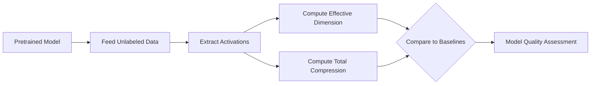

# Can You Predict a Network's Performance from Its Geometry Alone?

*We show that two unsupervised geometric metrics, effective dimension and total compression, predict neural network accuracy across 92+ models spanning vision, NLP, and language modeling, without requiring labels.*

---

## Introduction

What if you could assess a neural network's quality without ever running it on labeled data?

Predicting how well a neural network will generalize remains one of deep learning's fundamental challenges. Classical theory based on parameter counts and norms has repeatedly failed to explain why overparameterized networks generalize at all [1][2]. The most successful generalization measures require access to training data, labels, and often the training process itself [3].

We take a different approach. Instead of analyzing weights or training dynamics, we look at the **shape of the learned representations** — the geometry of the high-dimensional spaces that neural networks create as they transform input data through successive layers.

Our main finding is striking: **two simple, completely unsupervised geometric metrics predict neural network accuracy** across 92+ pretrained models spanning computer vision, natural language processing, and language modeling. These metrics — *effective dimension* and *total compression* — require only unlabeled data fed through the network, with no knowledge of ground truth labels or training history.

Explore the relationship yourself in the interactive plot below. Each point is a pretrained model; hover to see details, and click the legend to filter by architecture family.

  <iframe src="/posts/2026/02/14/geometric-signatures/fig1_model_explorer.html" frameborder="0" scrolling="no" height="620px" width="100%"></iframe>

## What Is Representation Geometry?

Neural networks transform input data through a sequence of layers, creating intermediate **representations** — high-dimensional vectors that encode increasingly abstract features. A ResNet-50, for example, transforms a 224x224 image through dozens of layers, each producing activations that live in spaces with hundreds or thousands of dimensions.

But not all of these dimensions are equally important. Much like how a sheet of paper is technically three-dimensional but effectively two-dimensional, neural network representations often occupy a lower-dimensional subspace of their ambient space. The question is: *how much* lower?

We answer this with two metrics, both computable from activations alone.

### Effective Dimension

Given a set of activations at any layer, we compute the covariance matrix and extract its eigenvalues $$\lambda_1, \lambda_2, \ldots, \lambda_D$$. The **effective dimension** is the participation ratio:

$$d_{\text{eff}} = \frac{\left(\sum_i \lambda_i\right)^2}{\sum_i \lambda_i^2}$$

This measures "how many dimensions are actually being used" [4]. If all eigenvalues are equal, $$d_{\text{eff}} = D$$ (using all dimensions). If a single eigenvalue dominates, $$d_{\text{eff}} \approx 1$$.

To build intuition, explore the eigenvalue spectra of four models below. Notice how better-performing models tend to have more concentrated spectra — fewer dimensions carrying most of the variance — but the effective dimension captures different aspects depending on the layer and architecture.

  <iframe src="/posts/2026/02/14/geometric-signatures/fig2_eigenvalue_explorer.html" frameborder="0" scrolling="no" height="570px" width="100%"></iframe>

### Total Compression

While effective dimension captures the geometry at a single layer, **total compression** captures how the network reshapes information from input to output:

$$C_{\text{total}} = \log\frac{d_{\text{eff}}^{\text{input}}}{d_{\text{eff}}^{\text{output}}}$$

A positive value means the network *compresses* — reducing the effective dimensionality of representations from input to output. This compression reflects the network's ability to distill raw input features into a compact, task-relevant code. Networks that compress more tend to have learned more structured, lower-dimensional representations at their final layer.

## The Main Finding

Across 52 pretrained vision models from 13 architecture families (ResNets, VGGs, EfficientNets, Vision Transformers, Swin Transformers, and more), we find remarkably strong correlations between geometry and accuracy:

- **Output effective dimension**: partial $$r = 0.746$$ ($$p < 10^{-10}$$) — the strongest single predictor
- **Total compression**: partial $$r = -0.720$$ ($$p < 10^{-9}$$)

The key word here is **partial** — these correlations control for model size (number of parameters). Geometry predicts accuracy *independently* of model capacity. A small model with good geometry outperforms a large model with poor geometry.

Use the dashboard below to explore how different geometric metrics relate to each other and to accuracy. The dropdowns let you select any pair of metrics for the X and Y axes.

  <iframe src="/posts/2026/02/14/geometric-signatures/fig3_correlation_dashboard.html" frameborder="0" scrolling="no" height="620px" width="100%"></iframe>

Perhaps most remarkably, these metrics are **completely unsupervised**. They are computed solely from the activations produced by feeding unlabeled data through the network. No labels, no training loss, no gradient information — just the shape of the learned representations.

## Does This Generalize Across Domains?

A natural question: is this a vision-specific phenomenon, or something more fundamental?

We tested across three domains:

1. **Computer Vision**: 52 pretrained models on CIFAR-10 and ImageNet, spanning 13 architecture families including both CNNs and Transformers
2. **NLP Encoders**: 8 transformer encoder models (BERT variants) fine-tuned on SST-2 sentiment analysis — correlation $$r = -0.96$$ ($$R^2 = 0.92$$)
3. **Decoder LLMs**: 7 autoregressive language models (GPT-2 variants and Pythia) fine-tuned on AG News classification

The relationship holds across all three, but with an important nuance: **the direction flips**. Encoder-style models (vision, BERT) compress representations — higher compression correlates with better accuracy. Decoder-style models (GPT-2, Pythia) *expand* representations through their layers, yet effective dimension at the output still correlates with performance.

This asymmetry may reflect fundamental architectural differences: encoders are designed to distill information into compact codes, while autoregressive decoders maintain rich, high-dimensional representations to predict the next token [5].

  <iframe src="/posts/2026/02/14/geometric-signatures/fig4_domain_explorer.html" frameborder="0" scrolling="no" height="620px" width="100%"></iframe>

## Is the Relationship Causal?

Observational correlations are suggestive, but can we establish a stronger link? We run two intervention experiments that perturb the geometry of a trained network and measure the effect on accuracy.

### Degradation via Noise

We inject noise directly into the final-layer activations of a trained ResNet-18. We test four noise types: Gaussian, uniform, dropout, and salt-and-pepper, at noise levels from 0.1 to 0.5.

The result is consistent across all noise types: **noise increases effective dimension** (by adding spurious, information-destroying dimensions to the representation) while **accuracy drops**. The pooled correlation between effective dimension change and accuracy change is $$r = -0.94$$ ($$p < 10^{-9}$$).

This is exactly what we'd predict if geometry *causally determines* classification performance: degrading the geometric structure directly harms the network's ability to classify.

  <iframe src="/posts/2026/02/14/geometric-signatures/fig5_noise_intervention.html" frameborder="0" scrolling="no" height="520px" width="100%"></iframe>

### Preservation via PCA

The complementary experiment: instead of degrading geometry, we *purify* it. We project final-layer activations onto their top principal components, discarding the rest, then measure classification accuracy.

The results are remarkable. At 95% variance preserved, **only 16 PCA components are needed** (out of 512 in the original representation), and accuracy drops by merely 0.04 percentage points. This confirms that the learned representations are remarkably low-dimensional — the network has concentrated nearly all task-relevant information into a tiny subspace.

  <iframe src="/posts/2026/02/14/geometric-signatures/fig6_pca_intervention.html" frameborder="0" scrolling="no" height="570px" width="100%"></iframe>

This connects to the information bottleneck theory [6][7]: effective networks learn to compress input information, retaining only what's relevant for the task. Our effective dimension metric quantifies exactly this compression, and the PCA intervention confirms it's not an artifact — the low dimensionality reflects genuine structure.

## When Does Geometry Emerge During Training?

If geometric structure is predictive of final performance, when does it emerge? We train 11 architectures from scratch on CIFAR-10 for 50 epochs, tracking all geometric metrics at 9 time points.

The key finding: **geometric structure becomes predictive early**. By epoch 5-10, effective dimension and silhouette score already differentiate models that will achieve high final accuracy from those that won't. Geometry is a *leading indicator* — it settles before accuracy plateaus.

This has practical implications: you could monitor geometric metrics during training to get early signals about final performance, potentially saving computational resources by abandoning runs with poor geometric trajectories.

  <iframe src="/posts/2026/02/14/geometric-signatures/fig7_training_dynamics.html" frameborder="0" scrolling="no" height="720px" width="100%"></iframe>

## What Does This Mean?

Our findings suggest that the geometry of learned representations encodes fundamental information about model quality that transcends architecture, domain, and scale. Two unsupervised metrics — effective dimension and total compression — provide a surprisingly complete picture of a network's classification ability.

**Practical implications:**

- **Unsupervised model assessment**: Evaluate pretrained models without labeled data — useful for model selection, quality control, and comparing checkpoints
- **Architecture search guidance**: Geometric metrics could serve as cheap proxy objectives for neural architecture search
- **Training monitoring**: Track geometric evolution as an early indicator of final performance

**Connection to GRaM themes**: This work reinforces the view that geometry is not merely a convenient lens for understanding representations — it reveals *fundamental structure* that directly determines function [8][9]. The strong correlation between unsupervised geometric metrics and supervised performance suggests that good representations converge toward a common geometric signature, consistent with the platonic representation hypothesis [5].

**Limitations and future directions:**
- Correlation strength varies by domain — strongest for vision, weaker for decoder LLMs
- The encoder/decoder asymmetry deserves deeper theoretical investigation
- Extending to generative models (diffusion, GANs) and multi-modal architectures remains open
- Connecting effective dimension to information-theoretic quantities like mutual information could provide theoretical grounding

---

### References

1. Zhang, C. et al. "Understanding deep learning (still) requires rethinking generalization." *Communications of the ACM*, 2021.
2. Neyshabur, B. et al. "Exploring generalization in deep nets." *NeurIPS*, 2017.
3. Jiang, Y. et al. "Fantastic generalization measures and where to find them." *ICLR*, 2020.
4. Roy, O. & Bhatt, R. "Effective dimensionality of random vectors." *IEEE Transactions on Information Theory*, 2007.
5. Huh, M. et al. "The platonic representation hypothesis." *ICML*, 2024.
6. Tishby, N. et al. "The information bottleneck method." *arXiv preprint physics/0004057*, 2000.
7. Shwartz-Ziv, R. & Tishby, N. "Opening the black box of deep neural networks via information." *arXiv:1703.00810*, 2017.
8. Ansuini, A. et al. "Intrinsic dimension of data representations in deep neural networks." *NeurIPS*, 2019.
9. Papyan, V. et al. "Prevalence of neural collapse during the terminal phase of deep learning training." *PNAS*, 2020.
